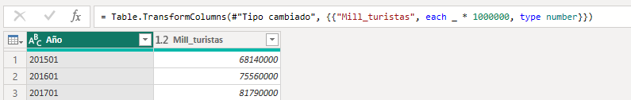
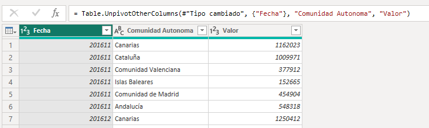
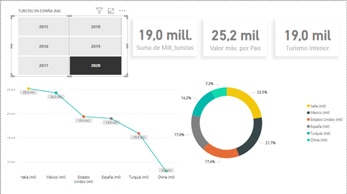
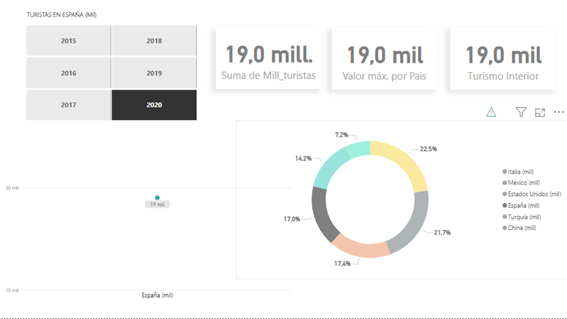
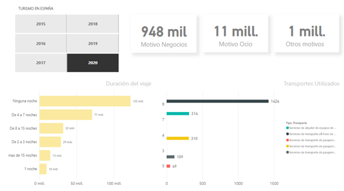
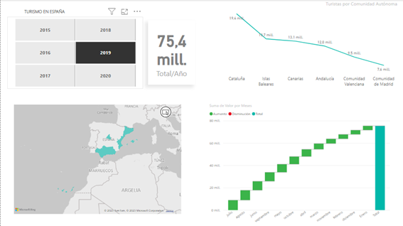
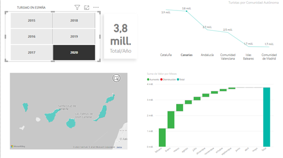

# proyecto-ETL-Turismo Visualización

El objetivo de este proyecto es la visualización de diferentes queries en base al proyecto anterior ETL Turismo en España. Se trata de visualizaciones interactivas donde se podrá consultar de manera clara, rápida y visual apareciendo información util sobre el tema.

• Las WEBS utilizadas por su fiabilidad en los datos:

[ine](https://www.ine.es/jaxiT3/Tabla.htm?t=12501)

[wikipedia](https://es.wikipedia.org/wiki/Turismo_en_España')

[epdata](https://www.epdata.es/)

* Después del trabajo ETL, hemos pasado todas nuestras tablas a csv para abrirlas en Power Bi y hemos transformado algunos datos en Power Query:

  Cambiando formato de datos

 Trasponiendo la tabla: 'turistas_llegados_diferentes_provincias'

  

* Hemos revisado las relaciones de las tablas antes de empezar la visualización.

* En la VISUALIZACIÓN, he priorizado la claridad y la interactividad en los datos. Muestro las pantallas:

**1ª Pantalla** 

Queries relacionadas con los paises de procedencia de los turistas en España.

La información está filtrada por años, desde 2015 a 2020, en España; pudiendo consultar:
- En la primera etiqueta: la suma total de turistas (millones) en el año seleccionado.
- En la segunda etiqueta: El valor del país de procedencia con más turistas en España en ese año seleccionado.
- Cuánta cantidad de turistas españoles (turismo interior) hubo en el año seleccionado.
- La proporción en los diferentes paises de procedencia de los turistas del año seleccionado.
- El valor de cada país y su posición respecto al resto de paises en el año seleccionado.

También podemos seleccionar sólo un país en concreto, en este caso España.

**2ª pantalla**

Queries relacionadas con el motivo del viaje, su duración y el transporte más utilizado para llegar a España.

La información está filtrada por años, desde 2015 a 2020, en España; pudiendo consultar por ejemplo en 2020:
- La duración del viaje, vemos como la mayoría de turistas no ha llegado a hacer noche en España.
- El motivo del viaje mayoritariamente es por ocio y
- El trasporte más utilizado es el aéreo; los datos cambiarían según los años seleccionados.

**3ª pantalla**

Queries relacionadas con las distintas comunidades autónomas visitadas.

La información está filtrada por años, desde 2015 a 2020, en España; pudiendo consultar por ejemplo en 2020:
- Cantidad total de turistas/año entre las seis comunidades autónomas que más turistas reciben.
- Cúales son las comunidades autónomas que más turistas reciben y cuales menos.
- Cantidades de turistas en cada provincia.
- También podemos seleccionar en el mapa una comunidad en concreto y en el gráfico de abajo aparecerá la cantidad de turistas por meses en esa comunidad autónoma como vemos en la foto de abajo.

